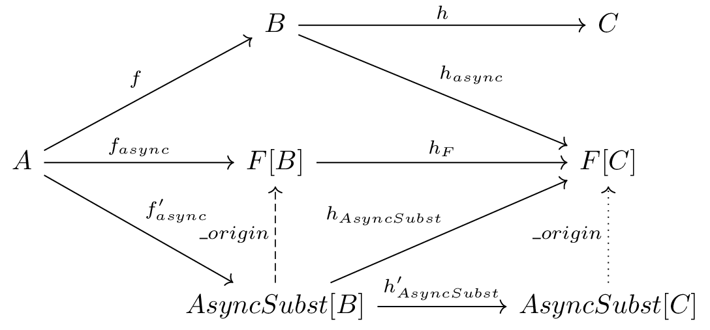

High-order functions.
=====================

Dotty-cps-async supports the automatic transformation of high-order functions,  where the lambda expression argument contains ``await``.  

For example, let us have a list of remote servers and fetch some data from each of them. 
Assume, that out http client provides next interface:

.. code-block:: scala

 trait HttpClient:
    def fetchData(url: String): Future[String] 

Then we can fetch data from all servers just by using ``await`` in the ``map`` argument:

.. code-block:: scala

     urls.map( await(httpClient.fetchData(_)) )

Note that the default ``map`` will run all operations sequentially. Sequential order of evaluation is needed to allow the code, like updating the multidimensional array in for loop, works correctly in an asynchronous case.

If we want all requests to run in parallel, we can start them in one map and when all started - wait for the end of requests:

.. code-block:: scala

       urls.map( httpClient.fetchData(_) ).map(await(_))

During async transform, dotty-cps-async substitute method map of you List with signature  
   ``List[A].map[B](f: A=>B)`` to  

:: index:: AsyncShift

.. code-block:: scala

 summon[AsyncShift[List[A]]].map[F[_],B](c,summon[CpsMonad[F]])
                    

which is implemented in cps runtime with signature

.. code-block:: scala

   AsyncShift[List[A]].map[F[_],B](obj:List[A],cpsMonad:CpsMonad[F])(f: A=> F[B])

Dotty-cps-async includes implementations of shifted methods for most of the standard library objects. So, it is possible to write something like ``x=cache.getOrElse( await(fetchData() )`` .

Providing shifted functions.
----------------------------

Functional interface.
^^^^^^^^^^^^^^^^^^^^^^

Suppose you want to make high-order methods of your class ``C`` be able to accept lambda functions with await. 
In that case, you should implement ``given AsynsShift[C]`` typeclass with a shifted version of your high-order methods.  
Such a 'shifted' version has an additional type parameter: ``F[_]``  and an additional list of arguments, inserted first, which contains the original object instance and an appropriative ``CpsMonad[F]``.  

Parameters should be changed in the following way:

* If the origin parameter has type  ``A=>B``, then changed: ``A => F[B]``
* If the origin parameter is called by name with type ``=>A``, then changed: ``()=>F[A]``
* Otherwise, the changed parameter has the same type as the origin.

Example:

.. code-block:: scala

 case class TaggedValue[T](tag: String, value:  T)
      def   modified[S](f: T => S): TaggedValue[S] =
          TaggedValue(tag, f(x))

 class TaggedValueAsyncShift[T] extends AsyncShift[TaggedValue[T]]:

      def modified[F[_],S](o:TaggedValue[T], m: CpsMonad[F])(f: T=>F[S]): F[TaggedValue[S]] =
          f(value).map(TaggedValue(tag,_))
             
 object TaggedValue:

      transparent inline given shiftedTaggedValue[T] as AsyncShift[TaggedValue[T] =
                                                                               TaggedValueAsyncShift[T]() 

Object oriented interface (obsolete, up to 0.3.5)
^^^^^^^^^^^^^^^^^^^^^^^^^^^^^^^^^^^^^^^^^^^^^^^^^^^^^

.. index:: ObjectAsyncShift

Sometimes, we can use classes, defines in the object-oriented manner, where data is private inside class.  If the developer of such class wants to provide API for dotty-cps-async, then he/she can do this without breaking encapsulation. What is needed - to implement AsyncShifted[F:CpsMonad] version inside  you class, which will accept methods with shifted parameters, and made a given ObjectAsync which should create instance of AsyncShifted from object and CpsMonad.

Example:

.. code-block:: scala

 class  MyIntController:
    private var x:  Int = 0;

    def  modify(f: Int => Int): Int =
       val old = x
       x = f(x)
       sendSignal(x)
       old

    def shifted[F[_]](m: CpsMonad[M]) = new MyIntControllerAsyncShifted[F]

    class  MyIntControllerAsyncShifted[F[_]](m: CpsMonad[M]) extends AsyncShifted[MyIntController,F]:
          
          def modify(f:  Int => F[Int]): F[Int] =
               val old = x
               m.map(f(x))(_ => { sendSignal(x); old }) 

Then we can define given instance for conversion:

.. code-block:: scala

 object MyIntController:

   class MyAsyncShift extends ObjectAsyncShift[MyIntController]:
          def apply[F[_]](obj:MyIntController, cpsMonad: CpsMonad[F]):obj.InternalAsyncShifted[F] =
                                                                                 obj.shifted(cpsMonad)

   transparent inline given myAsyncShift as ObjectAsyncShift[Zzz] = new MyAsyncShift()

Object oriented interface (after 0.3.6+)
^^^^^^^^^^^^^^^^^^^^^^^^^^^^^^^^^^^^^^^^^^^^^^^^^^^^

Sometimes, we can use classes, defines in an object-oriented manner, where data is private inside class.  If the developer of such a class wants to provide API for dotty-cps-async, then he/she can do this without breaking encapsulation. What is needed - to implement an async-shifted version of the function inside your class:

Example:

.. code-block:: scala

 class  MyIntController:
    private var x:  Int = 0;

    def  modify(f: Int => Int): Int =
       val old = x
       x = f(x)
       sendSignal(x)
       old

    def modify_async[F[_]](m: CpsMonad[M])(f: Int => F[Int]): F[Int] =
       val old = x
       m.map(f(x))(_ => { sendSignal(x); old }) 

As we have seen, shifted functions have an additional type parameter: F[_] and parameter CpsMonad[F]  (or more specific type, if needed).  Async transformer will substitute the call of `modify` into the call of `modify_async` during compilation.
   Sometimes,  we already have F[_] as the type parameter of the enclosing class. In such a case, we can omit those additional parameters in the async variant.

Note that you should carefully decide whether you need async function support and how to deal with concurrent modifications.  For example, in the code snippet below, different changes will interleave with each other.
 Usually, low-level constructs do not need async counterparts.

Special semantics for substitutions in call chains
^^^^^^^^^^^^^^^^^^^^^^^^^^^^^^^^^^^^^^^^^^^^^^^^^^^^^

  Consider chain of calls, which accept async-shifted functions.  One example is  'withFilter' from standard collections library.  Let's look on the next chunk of code:  

.. code-block:: scala

  for{ url ← urls if  await(status(url))==Active
        items ← await(api.retrieveItems(url))
        Item <- items
     } yield item  

Here usual semantics of `withFilter` assume that we iterate `urls` only once.  But if we will translate this expression according to standard rules, we will receive two passes: one pass in async `withFilter` and the second in `flatMap`.

To perform iteration once, we translate `withFilter` not to F[WithFilter] but to a substituted type DelayedWithFilter , which holds received predicate and delays actual evaluation upon the call of the next operation in chain.

The implementation of this class looks like:

.. code-block:: scala

 class DelayedWithFilter[F[_], A, C[X] <: Iterable[X], CA <: C[A]](c: CA,
                                         m: CpsMonad[F],
                                         p:A=>F[Boolean],
                                         ) 
                  extends CallChainAsyncSubst[F, WithFilter[A,C], F[WithFilter[A,C]] ]
 {
  // return eager copy
  def _origin: F[WithFilter[A,C]] = ...

  def withFilter(q: A=>Boolean): DelayedWithFilter[F,A,CX,CA] =  ...

  def withFilter_async(q: A=> F[Boolean]) = ...

  def map[B](f: A => B): F[C[B]] = ...

  def map_async[B](f: A => F[B]): F[C[B]] = ...

  def flatMap[B](f: A => IterableOnce[B]): F[C[B]] = ...

  def flatMap_async[B](f: A => F[IterableOnce[B]]): F[C[B]] = ...

  def foreach[U](f: A=>U): F[Unit] = ...

  def foreach_async[U](f: A=>F[U]): F[Unit] = ...

 }

I.e., in delayed variant implemented all original class methods, which should or collect operations into the next delayed object or perform an actual batched call.   
Also, we have the method `_origin`,  which is called when we have no next call in the chain: an example of such a case is   `val x = c.withFilter(p)`.  

By convention, the substituted type should be derived from CallChainAsyncSubst[F,T] 

This structure has a nice category interpretation,
If you are curious about that, let's look at the next diagram:

Let we have hight-order function :math:`f: A\to B` (example: :math:`f = withFilter: Iterable \to WithFilter`); then direct async transform will give us an async variant of :math:`f` -- :math:`f_{async}`  (example:  naive implementation of `withFilter_async`), and substituted is :math:`f'_{async}` (example - our delayed implementation of `withFiter_async`).  Here we write `AsyncSubst` instead `CallChainAsyncSubst` to save space on the picture.

For any function :math:`h: B->C`  from `B` to any `C`,  we have an image of `h` in `F[B]`: :math:`h_F = F.map(h)` and in AsyncSubst: :math:`h_{AsyncShift}`.
The diagram is commutative: 
 * :math:`h_{F} * f_{async} = h_{AsyncSubst} * f'_{async}` . (Example - `h` is `flatMap`, our implementation perform the same operation as usual flatMap, but in one batch with filtering).
 * :math:`\_origin * h'_{AsyncSubst}  = h_{AsyncSubst}` . (Example - `h` is `withFilter`  :math:`h'_{AsyncSubst}` is an implementation construct an next delayed instance with two predicates ).  

Moving to relations between functors, shown on the next diagram:

.. image:: diagrams/AsyncSubstFunctors.png

We can notice that `_origing` is a left Kan extension of `F` along `AsyncSubst`.  

This technique can be applied for cases where direct cps transform is impossible.  
  Example: cps transform of functional expression: `cps[S=>T]`, will give us not `F[S=>T]`,  but `S=>F[T]`.  We can't receive `F[T=>S]` from `T=>F[S]`, but can define an `AsynSubst[T=>S]` with implementation of `apply`, `andThen` and `compose`.

  

